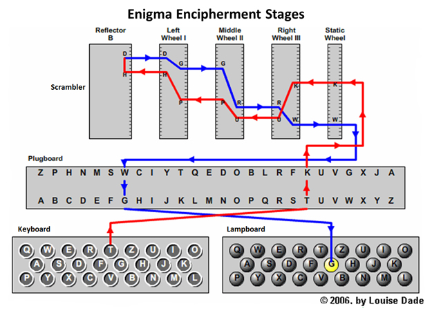

# Description 
Simulation of the enigma encryption machine used by Germany during WW2


# Dependencies 
- Python3.9


# Theory and history of the matchine:

The enigma machine is simple to compute. 

Look at the picture below. The user types on the keyboard, and what is outputed after encryption is shown on the lampboard. 
There are four layers of letter change (one plugboard + three rotor wheels) and one reflector which reflects the input back through the four layers of letter change once more. As a result, the input letter passes through the four layers of letter changes twice and once through the reflector as shown in the picture.



Specifics:

Plugboard: A letter is paired with another letter. Out of the 13 possible pairs only 10 are used. If a letter is not paired with another 
letter it simply remains unchanged. Direction doesn't matter (if a->b, b->a always, regardless of directions)

Rotors: 26 pairs of letters. Each of the 26 letters mapped onto another. Letters can map on to themselves. 5 rotors, from which 3 were chosen and placed in random order.  Direction matters (if a->b then b->a only if travelling in the opposite direction)

Reflector: 13 pairs of letters. Same letter pairs not allowed! Direction doesn't matter (if a->b, b->a always, regardlsess of direction)

Details about how direction matters in the rotors:
The letter scrambling in the 3 rotors is the opposite in the opposite direction, i.e. if a->h, in the direction right to left, then h->a in the direction left to right, but h-/>a in the direction right to left.  

Rotors change after each letter input:
The rotors rotate after every letter input. So if a rotor rotated by 1 position, it would have the effect of a->h to become b->h. Once the first rotor did a full circle, the second rotor would rotate by 1 position, like the hands of a clock. The base of the rotors could also be rotated manually. So by having the same positions for the three rotors, instead of starting from a->h, it would become a->i (next letter in the series).

The enigma machine problem:
The problem with the enigma machine is that the it never returns the same letter as the one inputted. This mistake occurred because the reflector would never return the signal from the same letter it came from, i.e. as can be seen from the diagram H->D in the reflector. This is what allowed the allies to break the code. 

Other notes:
The rotors were also not always rotating by 1, but sometimes they would rotate by more than 1, or they would rotate after 20 rotations of one rotor instead of 26. This was a disadvantage in the enigma machine, and it is not coded in the code.

History:
During the war, the Germans would alter on a daily basis:
- The plugboard connections 
- Choose three out of five standard rotors 
- Choose the order of the rotors. 


# How to execute  

In the directory 'EnigmaMachine' there is a a script called enigma.py and two text files. The text file 'inputText.txt' has the text that the script will read and encrypt. The encrypted text will be stored in the file 'encryptedText.txt'. 

To run the enigma script: 
```
python enigma.py
```

Note: If you copy the encrypted message from the 'encryptedText.txt' file and paste it in the inputText.txt' file (and making sure you have the same values) the machine will decrypt the message and return the original one

# Code description
There are 3 important methods in the script: 
1. encryptWithDefaultValues: 	This encrypts text with the default values (plugboard, reflector and rotor connections, as well as rotor positions). It is enough to see that the code works. 
2. encryptWithUserInput: 		This produces new random connections (for plugboard, reflector and rotor) and allows the user to import his/her own rotor positions. It outputs new connections and rotor positions
3. encryptWithPreExistingValues:	This reads the outputed random connections and rotor positions from method 2 and encrypts the text using them. 

These 3 methods can be found in the main method, 2 of them need to be commented out in order for the code to run


# Help 
For any help please email:
antonis.hadjipittas@gmail.com


# License 
GNU General Public License v3.0
